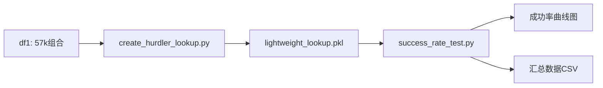

# HURDLER成功率测试模块

## 概述

该模块用于测试HURDLER三位点克隆方法在不同长度随机氨基酸序列上的成功率。

## 核心功能

- ✅ 生成4-60长度的随机AA序列
- ✅ 每个长度测试1000次
- ✅ 提取所有不重复的3mer AA（包括环状边界）
- ✅ 针对每个plasmid检查HURDLER方案可行性
- ✅ 绘制不同plasmid和不同长度的成功率曲线

## 文件结构

### 1. 数据生成脚本
- **`generate_hurdler_data.py`** - 生成df1（三位点酶组合，57,415行）
- **`create_hurdler_lookup.py`** - 创建优化的lookup字典（重要！）
- `generate_df2_only.py` - （已弃用，被create_hurdler_lookup.py替代）

### 2. 测试脚本
- **`hurdler_success_rate_test.py`** - 完整成功率测试（主要脚本）
- **`quick_test_hurdler.py`** - 快速验证测试

### 3. 文档
- **`HURDLER_SUCCESS_RATE_TESTING_GUIDE.md`** - 详细使用指南
- `README_HURDLER_SUCCESS_RATE.md` - 本文件

## 快速开始

### 步骤1: 生成lookup字典（一次性，~30分钟）

```bash
python create_hurdler_lookup.py
```

这会生成：
- `output/hurdler_3mer_lookup.pkl` - 完整lookup
- `output/hurdler_3mer_lightweight_lookup.pkl` - 轻量级lookup（测试用）

### 步骤2: 运行成功率测试

```bash
# 快速验证
python quick_test_hurdler.py

# 完整测试（4-60长度，1000次/长度）
python hurdler_success_rate_test.py
```

### 步骤3: 查看结果

测试完成后会生成：
- `output/hurdler_success_rate_by_length.png` - 主图（成功率曲线）
- `output/hurdler_success_rate_detailed.png` - 详细图（柱状图+热力图）
- `output/hurdler_success_rate_summary.csv` - 汇总数据
- `output/hurdler_success_rate_raw_results.csv` - 原始数据

## 关键优化

### 1. 轻量级Lookup字典

```python
# 结构：只存储key和plasmid兼容性
{
    frozenset(['ACE', 'DFG']): {
        'pET-28a(+)': True,
        'pGEX-4T-1': True
    }
}
```

- 不存储完整酶信息
- 只需检查key是否存在
- 内存占用小，速度快

### 2. 环状边界处理

重复蛋白序列考虑首尾相连：

```python
# 标准3mers: seq[i:i+3]
# 边界3mers:
#   seq[-2] + seq[-1] + seq[0]
#   seq[-1] + seq[0] + seq[1]
```

### 3. 无序配对

使用`frozenset`存储3mer对，避免重复检查：

```python
key = frozenset(['ACE', 'DFG'])  
# 等价于 frozenset(['DFG', 'ACE'])
```

## 结果示例

### 成功率曲线图

横坐标：序列长度（4-60）  
纵坐标：成功率（0-100%）  
每条曲线：一个plasmid

预期趋势：
- 短序列（<10）：成功率较低
- 中等序列（10-30）：成功率快速上升
- 长序列（>30）：成功率趋于稳定

## 命令行参数

```bash
python hurdler_success_rate_test.py \
    --min-length 4 \      # 最小长度
    --max-length 60 \     # 最大长度
    --n-trials 1000 \     # 每个长度测试次数
    --output-dir ./output # 输出目录
```

## 性能

### 预估运行时间

- Lookup创建：20-30分钟（一次性）
- Lookup加载：<1秒
- 完整测试：5-10分钟（57 × 1000 × 8 = 456,000次检查）

### 系统要求

- RAM: 4GB+
- 磁盘: 100MB+
- Python包: pandas, numpy, matplotlib, seaborn, tqdm, pickle

## 故障排查

### 1. Lookup文件不存在

```bash
# 检查是否生成完成
ls -lh output/hurdler_3mer_lightweight_lookup.pkl

# 重新生成
python create_hurdler_lookup.py
```

### 2. 测试太慢

```bash
# 减少测试次数
python hurdler_success_rate_test.py --n-trials 100

# 缩小范围
python hurdler_success_rate_test.py --min-length 10 --max-length 30
```

### 3. 内存不足

分批测试：

```python
for start in range(4, 61, 20):
    end = min(start + 19, 60)
    python hurdler_success_rate_test.py --min-length {start} --max-length {end}
```

## 输出文件说明

| 文件 | 大小 | 说明 |
|------|------|------|
| `hurdler_3mer_lightweight_lookup.pkl` | ~MB | 轻量级lookup（测试用） |
| `hurdler_success_rate_summary.csv` | ~KB | 汇总：长度×plasmid成功率 |
| `hurdler_success_rate_raw_results.csv` | ~MB | 原始数据（所有trial） |
| `hurdler_success_rate_by_length.png` | ~KB | 主图：成功率曲线 |
| `hurdler_success_rate_detailed.png` | ~KB | 详细图：柱状图+热力图 |

## 工作流程



## 下一步

1. ⏳ 等待lookup生成完成（~30分钟）
2. ✅ 运行quick_test验证
3. ✅ 运行完整测试
4. ✅ 分析结果图表
5. ✅ 根据需要调整参数重新测试

## 联系

如有问题，请查看详细指南：`HURDLER_SUCCESS_RATE_TESTING_GUIDE.md`
